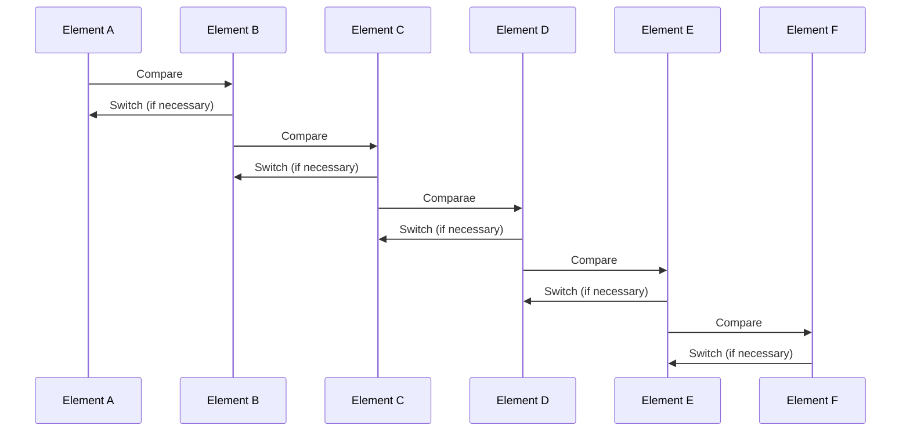

# Insertion sort
The basis of the *insertion sort algorithm* is an input of n numbers
$$
\begin{array}{c}
<a_1, a_2, \ldots, a_n >\\
\end{array}
$$

that are processed to return an ordered list of numbers such that:

$$
\begin{array}{c}
<a_1' <= a_2 <= a_3 <= \ldots<= a_n' >\\
\end{array}
$$

You can represent the algorithm with this graphic process:

## Mermaid Process Diagram:


## Pseudocode

```
InsertionSort(A)
    for i = 1 to n
        key = A[i]
        j = i - 1
        while j >= 0 and A[j] > key
            A[j + 1] = A[j]
            j = j - 1
        A[j + 1] = key
```

## The algorithm works as follows:

1. The first element is considered to be sorted.
2. The second element is compared with the first element and if it is smaller, it is inserted before the first element.(It makes a swap)
3. The third element is compared with the second element and if it is smaller, it is inserted before the second element.
4. The process continues until the last element is compared with the previous element and inserted in the correct position.

The algorithm has a time complexity of $O(n^2)$ and a space complexity of $O(1)$.
Which means that the algorithm is not efficient for large lists of numbers.

## References

- [Wikipedia](https://en.wikipedia.org/wiki/Insertion_sort)
- [GeeksforGeeks](https://www.geeksforgeeks.org/insertion-sort/)
- [Khan Academy](https://www.khanacademy.org/computing/computer-science/algorithms/insertion-sort/a/insertion-sort-pseudocode)
- [Brilliant](https://brilliant.org/wiki/insertion-sort/)
- [Programiz](https://www.programiz.com/dsa/insertion-sort)
- [StudyTonight](https://www.studytonight.com/data-structures/insertion-sort)
