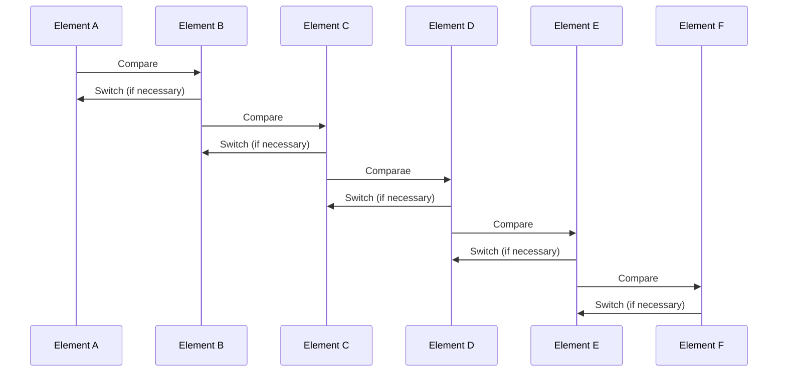

# Insertion sort
The basis of the *insertion sort algorithm* is an input of n numbers
$$
\begin{array}{c}
<a_1, a_2, \ldots, a_n >\\
\end{array}
$$

that are processed to return an ordered list of numbers such that:

$$
\begin{array}{c}
<a_1' <= a_2 <= a_3 <= \ldots<= a_n' >\\
\end{array}
$$

You can represent the algorithm with this graphic process:

The insertion sorting algorithm is simple because it is only a matter of going through each element (from the beginning) and comparing it with the element in front and, if necessary, making a change of position with that element.

