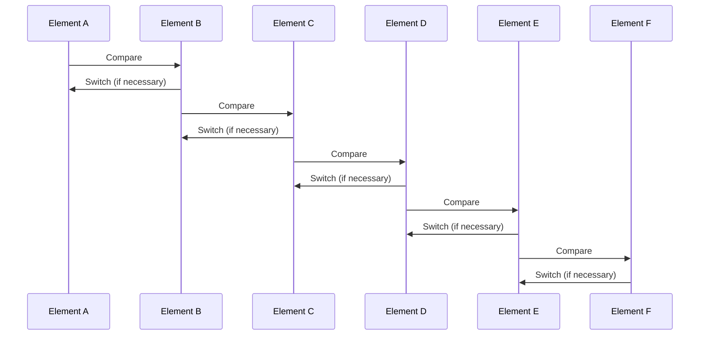

Selection sort is a simple sorting algorithm that works by selecting the smallest element from the list and swapping it with the first element. Then, it selects the second smallest element and swaps it with the second element, and so on. The algorithm has a time complexity of $O(n^2)$ and a space complexity of $O(1)$.

## The algorithm works as follows:

1. The first element is considered to be the smallest element.
2. The second element is compared with the first element and if it is smaller, it is considered to be the smallest element.
3. The third element is compared with the smallest element and if it is smaller, it is considered to be the smallest element.
4. The process continues until the last element is compared with the smallest element and swapped with the smallest element.

The algorithm is not efficient for large lists of numbers, but it is easy to implement and understand.

## Pseudocode

```
SelectionSort(A)
    for i = 0 to n-1
        min = i
        for j = i+1 to n
            if A[j] < A[min]
                min = j
        swap A[i] and A[min]
```

## Mermaid Process Diagram:



## References

- [Wikipedia](https://en.wikipedia.org/wiki/Selection_sort)
- [GeeksforGeeks](https://www.geeksforgeeks.org/selection-sort/)
- [Khan Academy](https://www.khanacademy.org/computing/computer-science/algorithms/sorting-algorithms/a/selection-sort-pseudocode)
- [Brilliant](https://brilliant.org/wiki/selection-sort/)
- [Programiz](https://www.programiz.com/dsa/selection-sort)
- [StudyTonight](https://www.studytonight.com/data-structures/selection-sort)
- [TutorialsPoint](https://www.tutorialspoint.com/data_structures_algorithms/selection_sort_algorithm.htm)
- [Sorting-Algorithms](https://www.sorting-algorithms.com/selection-sort)
- [HackerEarth](https://www.hackerearth.com/practice/algorithms/sorting/selection-sort/visualize/)
- [HackerRank](https://www.hackerrank.com/challenges/tutorial-intro/problem)

